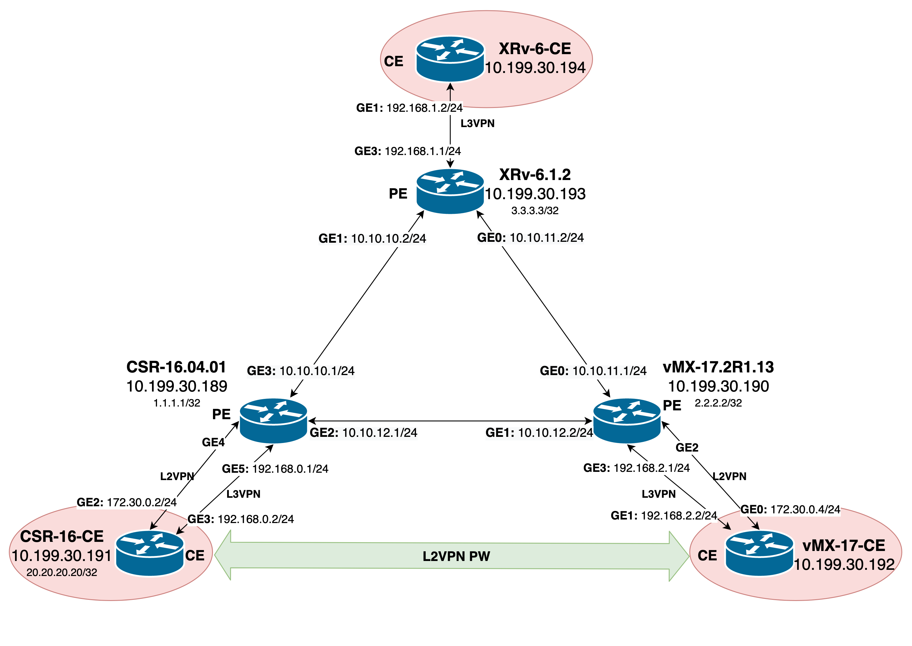

# Песочница по изучению и тестированию сетевых технологий

## Введение
При изучении сетевых технологий рано или поздно наступает момент, когда необходимо перейти к работе руками - взять роутер или коммутатор и начать его настраивать. Но дело в том, что собственный роутер это дорогое удовольствие для новичка в сфере сетевой инженерии. Поэтому абсолютное большинство начинающих используют среды для моделирования сетевого оборудования, такие как `Packet Tracer` от `Cisco` или `GNS3`. И это отличное решение ровно до того момента, пока вы не столкнетесь с багами внутри этих программ или вам не потребуется поднять или настроить что-то более серьезное, чем обычные `VLAN'ы`.

Проблемы необходимости дорогостоящего оборудования и ограниченности программных решений призвана решить наша песочница!

Другой кейс - необходимость протестировать работу нового сетевого решения какой-либо компании (например `FRINX`). Для этих целей, очень удобно использовать нашу песочницу. Нужно проверить как работает та или иная новая функция - поднимаем лабораторию за 5 минут и исследуем.

## Описание
Работает это очень просто. В основе песочницы лежат `Docker`-контейнеры в которых мы запускаем необходимые нам роутеры. При необходимости соединить несколько роутеров вместе - выполняем одну команду и получаем эффект аналогичный соединению интерфейсов с помощью провода. Все скрипты спрятаны внутрь решения [Vrnetlab](https://github.com/plajjan/vrnetlab) (и никто не мешает их менять!). Вам остается только придумать топологию, подумать о реализации и приступить к работе!

В нашей демонстрационной песочнице используются роутеры трех различных моделей:
1. Роутеры `CSR 1000v` версии `16.04.01` от `Cisco`
2. Роутеры `IOS XRv` версии `6.1.2` от `Cisco`
3. Роутеры `vMX` версии `17.2R1.13` от `Juniper`.

Предложенная топология призвана моделировать топологию провайдерской сети с `CE` и `PE` роутерами. Три центральных роутера используют для распределения маршрутов и передачи данных такие протоколы, как `ISIS`, `MPLS (LDP)` и `BGP`. Между всеми `CE` роутерами настроен `L3 VPN`, а между двумя нижними поднят `L2 VPN PW (PseudoWire)`.



## Системные требования
Системные требования зависят от оборудования и его количества, которое вы собираетесь запускать. Более подробно об этом можно прочитать на странице [Vrnetlab](https://github.com/plajjan/vrnetlab) в разделах посвященных различным роутерам.
В случае нашей демонстрационной реализации, потребуются:
1. `Ubuntu 18.04` или новее
2. 32Гб RAM
3. 30Гб HDD
4. Как минимум 6-ти ядерный процессор

### Поддерживаемое оборудование
Обратите внимание на список поддерживаемых `Vrnetlab` моделей сетевых устройств:
* Arista vEOS
* Cisco CSR1000v
* Cisco Nexus NX-OS (using Titanium emulator)
* Cisco XRv
* Cisco XRv 9000
* Juniper vMX
* Juniper vQFX
* Nokia VSR

## Установка 
Внимание! Установка требует наличия образов сетевого оборудования.

### Подготовка системы
Перед установкой `Vrnetlab` необходимо подготовить систему и установить необходимые пакеты. Такие как `Docker`, `git`, `ssh`. Для их установки можно воспользоваться командами приведенными ниже:
```
$ sudo apt update
$ sudo apt -y install python3-bs4 sshpass make
$ sudo apt -y install git
$ sudo apt install -y \
  apt-transport-https ca-certificates \
  curl gnupg-agent software-properties-common
$ curl -fsSL https://download.docker.com/linux/ubuntu/gpg | sudo apt-key add -
$ sudo add-apt-repository \
  "deb [arch=amd64] https://download.docker.com/linux/ubuntu \
  $(lsb_release -cs) \
  stable"
$ sudo apt update
$ sudo apt install -y docker-ce docker-ce-cli containerd.io
```
### Установка Vrnetlab
Для установки `Vrnetlab` клонируйте репозиторий `GitHub` на свою машину. В данном случае, клонируем его в домашнюю директорию:
```
$ cd ~
$ git clone https://github.com/plajjan/vrnetlab.git
```
Переместитесь в директория `vrnetlab`:
```
$ cd ~/vrnetlab
```
Теперь вы можете увидеть все необходимые скрипты и директории. Обратите внимание, что для каждого отдельного типа устройства есть отдельная директория:
```
$ ls
CODE_OF_CONDUCT.md  config-engine-lite        openwrt           vr-bgp
CONTRIBUTING.md     csr                       routeros          vr-xcon
LICENSE             git-lfs-repo.sh           sros              vrnetlab.sh
Makefile            makefile-install.include  topology-machine  vrp
README.md           makefile-sanity.include   veos              vsr1000
ci-builder-image    makefile.include          vmx               xrv
common              nxos                      vqfx              xrv9k
```

### Создаем image устройства

Для каждого роутера, поддерживаемого `Vrnetlab` есть определнный скрипт по первоначальной настройке. Для его запуска необходимо перейти в директорию интересующего вас устройства, ознакомиться с `README`, загрузить в папку образ устройства и выполнить команду `make docker-image`. Например для `CSR` процесс выглядит следующим образом:
```
$ cd ~/vrnetlab/csr
$ wget ... # Укажите адрес для скачивания
$ sudo make docker-image
```
По завершении установки, должны увидеть в списке образов `Docker` следуюшую строчку:
```
$ docker image ls
REPOSITORY          TAG                 IMAGE ID            CREATED             SIZE
vrnetlab/vr-csr     16.04.01            249394f62747        10 hours ago        1.82GB
```

### Запускаем устройство
Перед запуском устройства создадим `macvlan bridge` - сеть, которая позволит нам выдать `ip` адреса из локальной сети контейнерам:
```
$ docker network create -d macvlan -o macvlan_mode=bridge --subnet=10.199.30.0/24 --gateway=10.199.30.1 -o parent=enp1s0f0 macvlan_bridge
```
Где `subnet` - нужная нам подсеть, `gateway` - адрес `gateway` роутера, а `parent` - имя интерфейса через который производится выход в локальную сеть.

Для запуска устройства будем использовать команду:
```
$ docker run -d --privileged --name csr16-CE --net macvlan_bridge --ip 10.199.30.191 vrnetlab/vr-csr:16.04.01
```
Где `ip` - необходимый нам адрес в нашей локальной сети.

Через некоторое время устройство запустится и вы должны увидеть:
```
$ sudo docker ps -a
CONTAINER ID        IMAGE                       COMMAND                  CREATED             STATUS                 PORTS               NAMES
c978d34eef67        3ed053a54816                "/launch.py"             5 weeks ago         Up 5 weeks (healthy)                       csr16.04.01
```
На этом базовая установка завершена.

### Соединяем устройства между собой

Для соединения устройств между собой (пробрасывание виртуального провода) необходимо выбрать два интересующих вас устройства и выполнить следующую команду:
```
$ docker run -d --name vr-xcon-vmx_2-csr_1 --link vmx17-not_local --link csr16.04.01 --net macvlan_bridge vrnetlab/vr-xcon --p2p vmx17-not_local/2--csr16.04.01/1
```
Где `name` - это название контейнера, `link` - указывает устройства к которым необходимо присоединить этот контейнер, `net` - указывает на созданный прежде `macvlan_bridge`, а в `p2p` необходимо в правильном формате указать, на каком устройстве какой по счету интерфейс нужно использовать. Это можно понииать буквально как `{device_name}/{interface_number}--{device_name}{interface_number}`. Отсчет номеров интерфейсов начинается с единицы.

## Настройка песочницы

Для настройки песочницы можно воспользоваться заготовленными нами скриптами. Ниже вы можете найти все необходимые файлы и конфигурации устройств для получения аналогичной нашей топологии.


